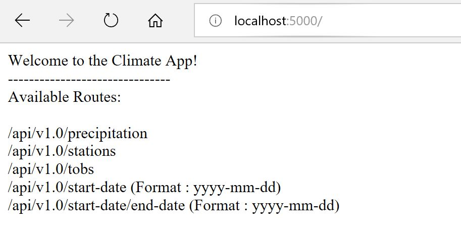
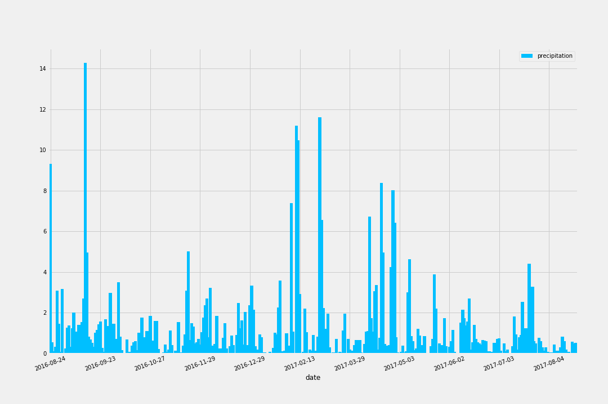
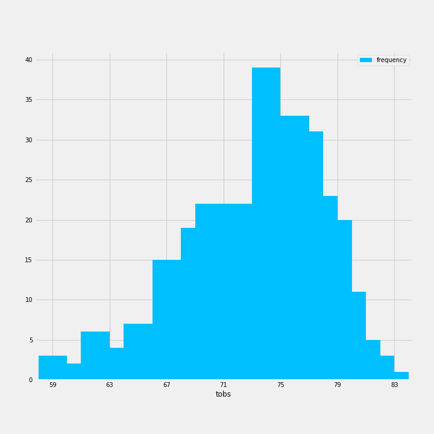
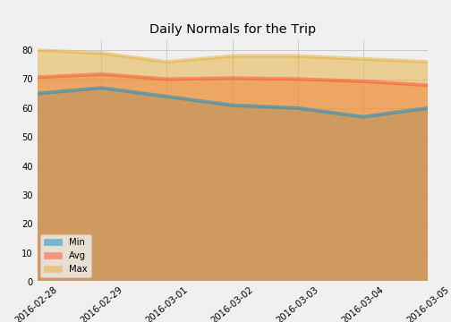

# Flask App - Surf UP
AdvancedSQL-Surf

### Home Page with all the possible Navigation Paths
Flask app allows the users to navigate to following paths to get the detailed information about precipitation, stations, Tobs and Mim ,Avg & Max Temparatures

### Precipitation Data
Following graph shows 12 month precipitation observations

Following Screenshot is from the Flask App that shows the raw data in HTML and JSON Format

### Tobs Data
Following Graphs show the Temprature observations

Following Screenshot is from the Flask App that shows the raw data in HTML and JSON Format

### Stations Data
Following Screenshot is from the Flask App that shows the raw data of Stations in HTML and JSON Format

### Functions Min,Avg & Max Temparatures  
The screenshots are from the Flask app that calls python functions in the background to get the Min , Max and Average Temparatures based on the dates entered.

### Figure shows Daily normals for the Trip
